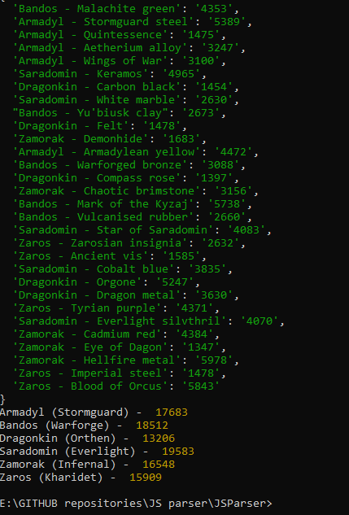

# Simple Runescape WebApi parser for archaeology
This simple command line parser requests the prices of all materials from RS archaeology, separates them into different categories based on their type and sums them up.

Such price comparison is useful to determine into which area you should invest your resources and which materials can be sold for the highest price on the Grand Exchange.

## Overview

    

It is possible to run this script via the supplied .bat file, however it is required to rewrite the correct location in the bat file's commands.
Also, node.js framework must be installed to run this script.

*© Copyright Andrew Coachman 2021, all rights included*
